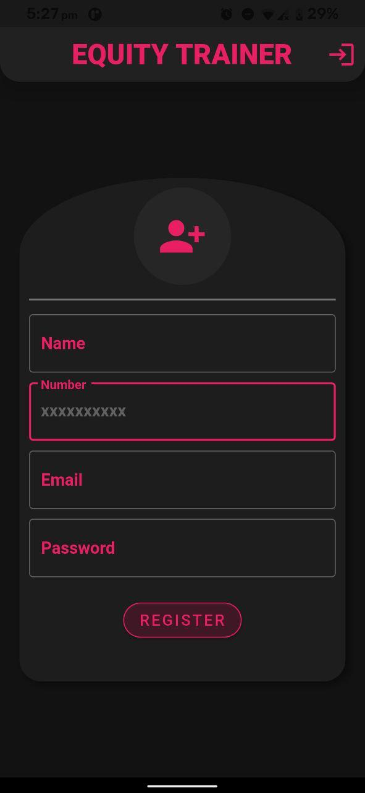
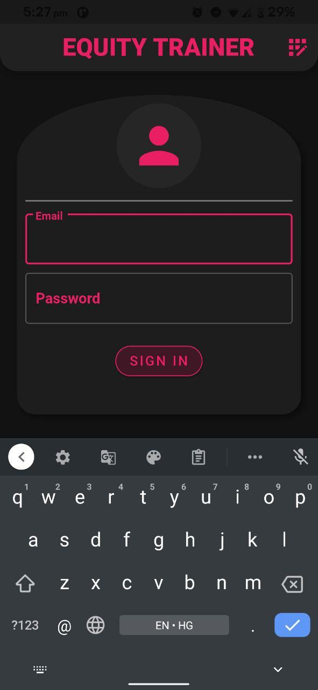
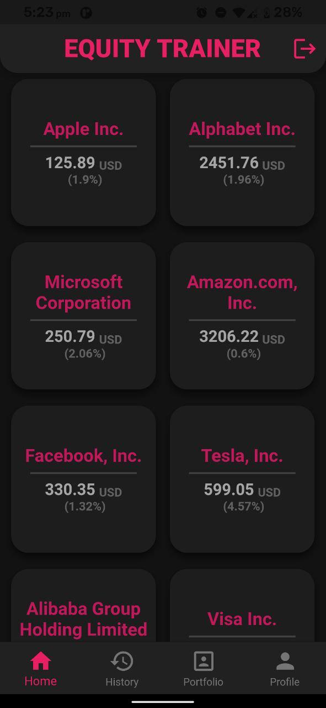
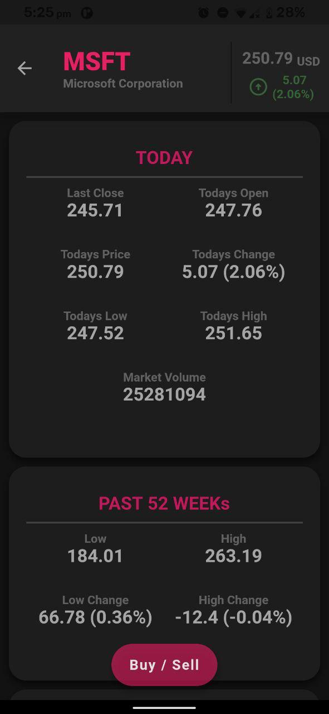
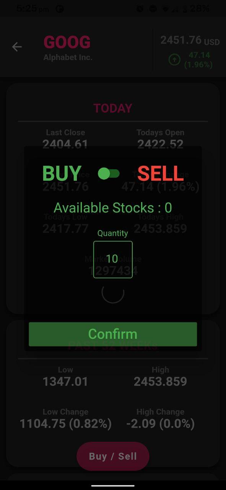
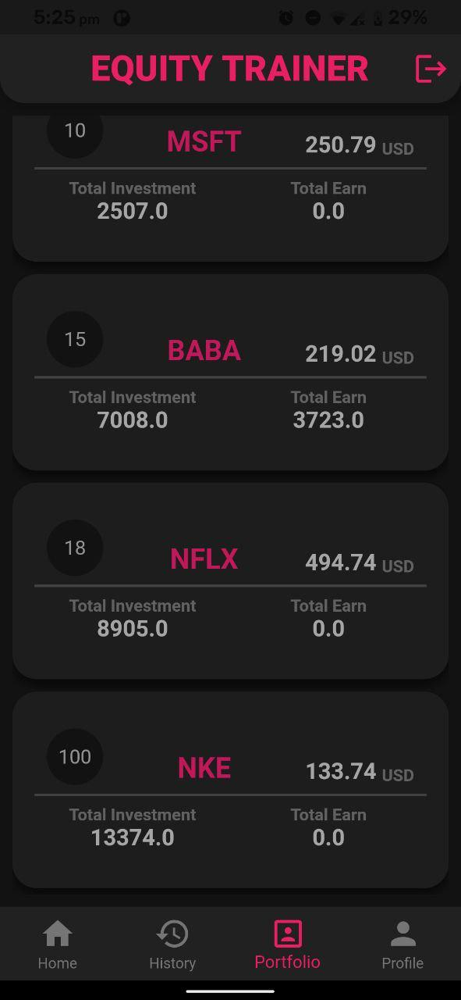
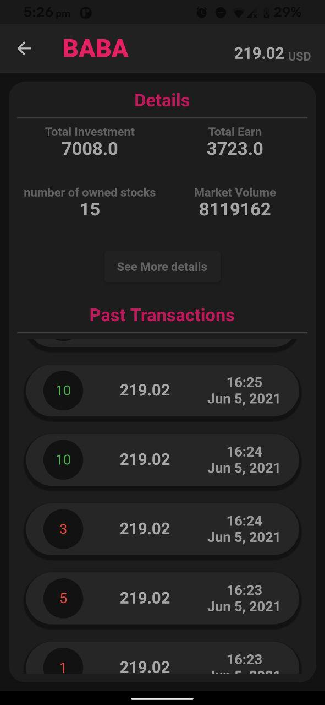
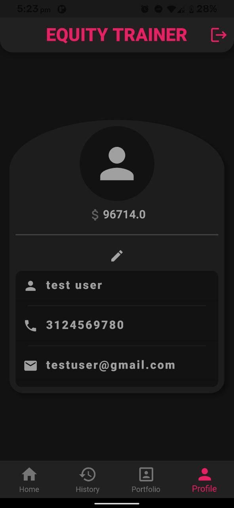
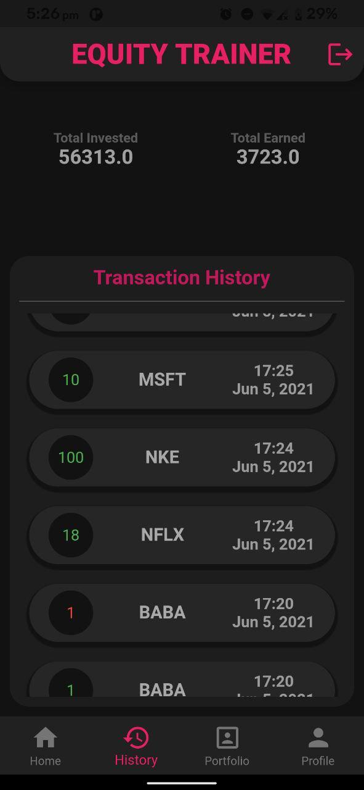

# Equity Trainer

A Flutter based Application for trying out Equity Exchange with tocken money. This Project is to help new investers to first get an idea of how the stock market works.
data managment and user authentication of the applicaiton is managed on firebase, so this app has real time data-management.

The code of the application is currently hidden due to privacy.
But you can use the apk file of the application and below is the description of the application.

## Getting Started

Users can register the on the application with Email Id and Password with the name and number(Not necessarily valid).

### Register Screen

  

Or if already created one then just Log-In into the application.

### Login Screen

  

Inside the the home page we have several different stocks tiles with their name and cuurent prize, etc.

### Home Screen

  

here, to see more information about stock, user can click on the individual stock tile

### Stock Details Screen

  

to Sell or Buy stocks user can click on the sell/Buy button

### Stock Transaction Screen

  

user can also see the portfolio from the home screen by clicking on portfolio button

### Portfolio Screen

  

here, to see more information about perticular stock transactions, user can click on the individual stock tile

### Potfolio Stock Details Screen

  

and, to see the profile screen user can click on the profile button

### Profile Screen

  

and, to see the Transaction History screen user can click on the History button

### TransactionHistory Screen

  

